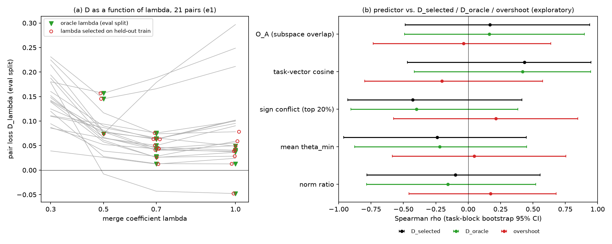

# λ-decomposition of E1 merge loss (C1): EXPLORATORY

*Generated 2026-09-25 (KST) by `analysis/lambda_decomp.py` from `e1/artifacts/e1_predictive/{pair_results.csv, predictors.csv, stage0.json}`. This analysis was not pre-registered in E1. It is exploratory and must be labelled as such wherever it is cited.*
Machine outputs: `lambda_decomp_e1.json`, `lambda_decomp_e1_pairs.csv` (per pair), `lambda_decomp_e1_stats.csv` (all cells), `lambda_decomp_e1_table.md` (auto-generated full table), `fig_lambda_decomp_e1.png`.

## Question

Is the E1 pair loss $D$ mostly a merge-coefficient artefact (a poorly chosen λ), or does it remain at the best λ? And do the weight-space predictors track the λ-free part, the λ-selection part, or neither?

## Definitions

For each pair, $D_\lambda$ is the task-arithmetic pair loss on the full validation split at fixed $\lambda \in \{0.3, 0.5, 0.7, 1.0\}$ (`val_D_lam*`).
- $D_{\text{selected}} = D$ at the λ chosen on the seed-0 1,000-example training subsets. This is the pre-registered target, reproduced exactly: max |diff| = 0.
- $D_{\text{oracle}} = \min_\lambda D_\lambda$, the best grid λ chosen **on the validation split itself**. It is descriptive and optimistically biased.
- $\text{overshoot} = D_{\text{selected}} - D_{\text{oracle}} \ge 0$, the loss attributable to λ selection.
- Extra: $\text{overshoot}_{\lambda=1} = D_{\lambda=1} - D_{\text{oracle}}$, the cost of untuned TA.

**Statistics.** These are identical to E1 stage 3.
- Spearman ρ over the 21 pairs.
- Task-block bootstrap: 2,000 draws, 1,838 used, 162 degenerate draws skipped, percentile 95% CI.
- Task-label permutation test: 10,000 draws; two-sided p is reported.
- Exact enumeration over all 7! = 5,040 relabelings, reported in the full table.
- Holm correction across the five predictors within each target, for bookkeeping only.

**Reproduction check.** For target $D_{\text{selected}}$, the script reproduces E1 bit for bit: ρ(O_A) = 0.168, CI [−0.487, 0.938], two-sided permutation p = 0.558, and the same ρ and CI for all four other predictors.

## Descriptive decomposition (21 pairs)

| quantity | mean | median | range | task-block 95% CI of mean |
|---|---:|---:|---|---|
| $D_{\text{selected}}$ | 0.0532 | 0.0488 | [−0.048, 0.157] | [0.025, 0.087] |
| $D_{\text{oracle}}$ | 0.0512 | 0.0444 | [−0.048, 0.157] | [0.024, 0.084] |
| overshoot | **0.0021** | 0.0000 | [0.000, 0.031] | [0.000, 0.007] |
| overshoot at λ = 1 (untuned TA) | 0.0301 | 0.0109 | [0.000, 0.223] | [0.007, 0.073] |
| $D_{0.3}$ / $D_{0.5}$ / $D_{0.7}$ / $D_{1.0}$ | 0.146 / 0.073 / 0.060 / 0.081 | | | see full table |

- The held-out λ matches the oracle λ in **17 of 21** pairs. Selected × oracle: 0.5→0.5 in 3 pairs; 0.7→0.7 in 9, 0.7→1.0 in 1; 1.0→1.0 in 5, 1.0→0.7 in 3.
- Overshoot accounts for **3.9%** of the summed $D$. The largest overshoot is QNLI–RTE, at 0.031.

## Predictor correlations (exploratory)

| predictor | ρ with $D_{\text{selected}}$ [95% CI] | ρ with $D_{\text{oracle}}$ [95% CI], perm. p | ρ with overshoot [95% CI], perm. p | ρ with overshoot at λ = 1 [95% CI], perm. p |
|---|---|---|---|---|
| O_A (subspace overlap) | 0.168 [−0.49, 0.94] | 0.162 [−0.49, 0.90], p = 0.60 | −0.036 [−0.73, 0.64], p = 0.80 | 0.029 [−0.57, 0.75], p = 0.94 |
| task-vector cosine | 0.435 [−0.47, 0.95] | 0.421 [−0.42, 0.95], p = 0.065 | −0.203 [−0.80, 0.58], p = 0.37 | 0.480 [−0.13, 0.91], p = 0.030 |
| sign conflict (top 20%) | −0.427 [−0.93, 0.42] | −0.399 [−0.91, 0.38], p = 0.081 | 0.214 [−0.58, 0.85], p = 0.34 | −0.506 [−0.84, 0.11], p = 0.021 |
| mean θ_min | −0.240 [−0.96, 0.45] | −0.221 [−0.88, 0.45], p = 0.47 | 0.047 [−0.59, 0.75], p = 0.78 | −0.107 [−0.77, 0.53], p = 0.74 |
| norm ratio | −0.097 [−0.78, 0.56] | −0.157 [−0.78, 0.52], p = 0.56 | 0.172 [−0.46, 0.68], p = 0.40 | 0.166 [−0.59, 0.80], p = 0.52 |

Fixed λ (ρ with $D_\lambda$ [95% CI]):

| predictor | λ = 0.3 | λ = 0.5 | λ = 0.7 | λ = 1.0 |
|---|---|---|---|---|
| O_A | −0.616 [−0.95, 0.41] | 0.191 [−0.49, 0.82] | 0.209 [−0.45, 0.84] | 0.225 [−0.27, 0.96] |
| task-vector cosine | 0.003 [−0.62, 0.79] | 0.323 [−0.62, 0.96] | 0.395 [−0.39, 0.92] | 0.451 [−0.25, 0.93] |
| sign conflict | 0.055 [−0.73, 0.66] | −0.282 [−0.92, 0.59] | −0.378 [−0.85, 0.38] | −0.443 [−0.88, 0.25] |
| mean θ_min | 0.569 [−0.34, 0.91] | −0.214 [−0.77, 0.49] | −0.257 [−0.81, 0.41] | −0.290 [−0.98, 0.25] |
| norm ratio | 0.199 [−0.66, 0.81] | −0.281 [−0.85, 0.50] | −0.208 [−0.78, 0.49] | −0.036 [−0.78, 0.60] |

All permutation p-values and within-target Holm values are in `lambda_decomp_e1_table.md`. After Holm correction within target, no cell is below 0.10; the smallest are 0.106 and 0.121, for overshoot at λ = 1. Task-vector cosine and sign conflict are almost the same variable on these pairs (Spearman −0.988 between them), and O_A and mean θ_min are almost mirror images (−0.987).



*Figure. (a) Validation pair loss $D_\lambda$ against the merge coefficient for the 21 E1 pairs (grey lines). Triangles mark the oracle λ (chosen on validation); open circles mark the λ selected on held-out training examples. (b) Spearman ρ with 95% task-block bootstrap intervals between each weight-space predictor and $D_{\text{selected}}$, $D_{\text{oracle}}$, and the overshoot. Exploratory.*

## Findings (exploratory; to be stated as such)

1. **E1's pair loss is not a λ-selection artefact.** On the E1 grid, selecting λ on 1,000 held-out training examples lands on the validation-optimal λ in 17 of 21 pairs. The mean overshoot is 0.002 (task-block CI [0.000, 0.007]), or 3.9% of the total loss. What remains, $D_{\text{oracle}} = 0.051$ [0.024, 0.084], is loss that no grid λ removes.
2. **Untuned TA (λ = 1) would have added a λ effect.** The mean overshoot at λ = 1 is 0.030 [0.007, 0.073], with a maximum of 0.22 (MRPC–QQP, whose best λ is 0.5). The merge coefficient matters, but the pre-registered held-out selection already absorbs most of its effect.
3. **None of the predictors ranks the λ-free residual.** ρ(O_A, $D_{\text{oracle}}$) = 0.16 [−0.49, 0.90]. Task-vector cosine and sign conflict give 0.42 [−0.42, 0.95] and −0.40 [−0.91, 0.38]. The picture for $D_{\text{oracle}}$ is essentially that of the pre-registered target, as expected given finding 1.
4. **None of the predictors ranks the overshoot**, with |ρ| ≤ 0.21 throughout. With 17 of 21 overshoot values exactly zero, this target has little information.
5. **Hint for E1b, not a result.** Task-vector cosine and sign conflict track how much untuned λ = 1 overshoots: ρ = 0.48 [−0.13, 0.91] and −0.51 [−0.84, 0.11], uncorrected p = 0.030 and 0.021, Holm within target 0.12 and 0.11. Both bootstrap intervals include 0. The direction matches the over-accumulation account (SVC): pairs whose updates point the same way are hurt more when both are added at full strength. It also matches the seed pair, where λ = 1 → 0.5 moves MNLI accuracy from 0.693 to 0.825, and the lemma: for aligned updates, the gate is a local version of that λ reduction.
6. **The λ = 0.3 sign change of O_A.** ρ = −0.62 [−0.95, 0.41] occurs where every pair is under-merged (mean $D_{0.3}$ = 0.146). A plausible reading is that pairs with more overlap accumulate more update along the shared directions and so suffer less from shrinkage. The interval includes 0, so this remains speculative.

**Caveats.**
- $D_{\text{oracle}}$ is chosen on the evaluation split and is optimistically biased.
- The 4-point grid bounds both the oracle and the overshoot. A finer grid could shift the oracle λ.
- The selection subsets overlap the adapters' training data (E1 deviation #9).
- K = 7 tasks makes every interval wide.

## Rerunning on E1b

The script auto-detects the E1b schema (`TA_eval_D_lam*`, `lam_selected`, `D`) and takes the task order from `stage0.json:valid_tasks`:

```bash
/workspace/lora-paper/e1/.venv/bin/python /workspace/lora-paper/analysis/lambda_decomp.py --in /workspace/lora-paper/e1b --tag e1b
# writes analysis/lambda_decomp_e1b{.json,_pairs.csv,_stats.csv,_table.md} and analysis/fig_lambda_decomp_e1b.png
```

- **Bootstrap CIs.** The bootstrap stream (`default_rng(0)`, 2,000 × `integers(0, K, K)`, same degenerate-draw rule) is the same one E1b's stage 3 uses, so the CIs for $D_{\text{selected}}$ should match E1b's `analysis.json` exactly.
- **Permutation p-values.** E1b draws its 10,000 relabelings differently (`argsort` of uniforms), so these p-values will differ slightly from E1b's own. They are exploratory either way.
- **Exact enumeration** is skipped when K > 8.
- **Evaluation splits.** For AG News, IMDB, TREC and Yelp, the E1b evaluation split is the test split. $D_{\text{oracle}}$ there means "best λ on the evaluation split".
- **Test run.** The script was checked on a synthetic 16-task / 120-pair file in E1b format; it runs in about 25 s on the box.
